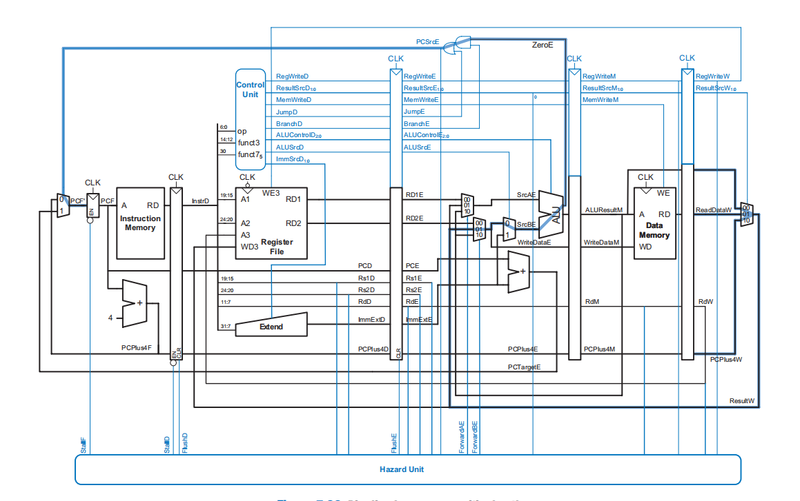

# 项目名称
## 五级流水线的 13 指令 RISC-V CPU
# 项目简介
## 这是一个用SystemVerilog编写的MIPS CPU的实现。这个项目处于比较早期的阶段，目前只实现了riscv CPU基本的功能。

### 32位MIPS处理器
### 用SystemVerilog实现
### 5阶段流水线
### 动态“分支未取”分支预测器
### 在解码阶段（第二阶段）进行分支检测
### 支持停顿以避免读后写（RAW）和其他危害
### 可以从内存（第四阶段）和写回（第五阶段）前送以避免停顿
# 数据通路

